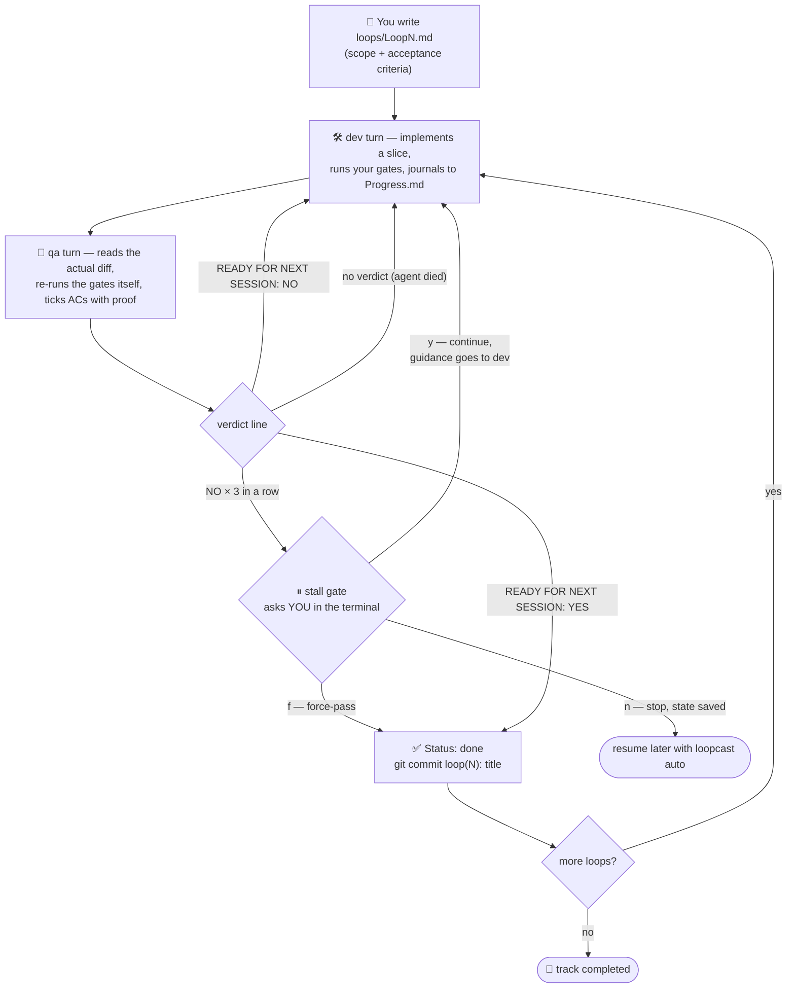

# loopcast

[](https://www.npmjs.com/package/loopcast)
[](LICENSE)
[](package.json)
[](package.json)
[-lightgrey)](#faq)

**Ship features while you sleep — with a reviewer that doesn't trust the implementer.**

loopcast runs a **dev ⇄ QA agent loop** over spec files *you* write. One agent implements;
a *different* agent — ideally a different vendor's CLI — adversarially reviews the work and
re-runs your quality gates itself. A grep-able verdict line decides whether the loop
advances. When it does, loopcast commits the work as one clean commit and moves to the next
spec. Humans write the specs; the tool never invents scope.

```
Loop1.md (your spec) → dev implements → qa reviews → NO → dev fixes → … → YES → git commit → Loop2.md
```

- **Zero runtime dependencies** — plain Node ≥ 20, nothing else.
- **Agents:** `claude` (Claude Code) and `codex` (Codex CLI) — either can play either role,
  including both the same. Default: Claude implements, Codex reviews.
- **The orchestrator owns all bookkeeping.** Agents communicate *only* through an
  append-only `Progress.md` journal. They never talk to each other directly, never commit,
  never push.

## Why this shape?

**Two different CLIs** — an agent reviewing its own work shares its blind spots. A second
vendor's model with an adversarial review prompt — one that must *re-run the gates itself*
and tick acceptance criteria with proof — catches what the implementer's self-review
misses. The strict `READY FOR NEXT SESSION: YES|NO` contract turns that review into
something a script can act on. This pattern has driven 90+ shipped loops of a production
codebase unattended.

**Human-written specs** — the loop is only as good as its acceptance bar, and a spec the
tool invented would be a bar the tool set for itself. `Loop<N>.md` files are requirements:
written by you, with concrete acceptance criteria the reviewer can verify. Both role
prompts hard-forbid agents from creating loop specs.

## Quickstart

```sh
npm install -g loopcast
cd your-project        # must be a git repo
loopcast init          # setup questions + scaffolds .loopcast/main/
```

On a TTY, `init` asks a few setup questions (blank keeps the shown default): which CLI
plays dev and qa, the claude model, and optionally a `CLAUDE_CODE_OAUTH_TOKEN`. Answers go
to `loopcast.config.json` (auto-gitignored — per-dev settings); the token goes to
`.loopcast.env` (mode 600, auto-gitignored) and is injected into every agent turn —
overriding the shell's copy, so a freshly saved token beats an expired exported one.
Piped/CI stdin skips the questions.

Then:

1. Open `.loopcast/main/dev-prompt.md` and `qa-prompt.md`, replace the marked
   `<!-- project gates: ... -->` block with your real build/lint/test commands.
2. *(optional)* Drop your PRD / phase docs into `.loopcast/main/PRD/`.
3. Write `.loopcast/main/loops/Loop1.md`:

   ```markdown
   # Loop 1 — add a health endpoint

   Status: planned

   ## Scope
   GET /healthz returns 200 {"ok":true}.

   ## Acceptance criteria
   - [ ] AC1 — endpoint responds 200 with the exact body
   - [ ] AC2 — covered by a test
   ```

4. Run it: `loopcast step` to watch one turn live, or `loopcast auto` to let it run.

## Commands

Every command takes an optional track name (default `main`) — a track is one independent
queue of loops under `.loopcast/<track>/`.

| Command | What it does | When you reach for it |
|---|---|---|
| `loopcast init [track]` | Interactive setup (agents, model, token) + scaffolds `.loopcast/<track>/` — prompts, `PRD/`, `loops/`, journal. Re-running never overwrites or resets anything. | Once per track — and again any time you want to change agents or refresh an expired token. |
| `loopcast step [track]` | Runs **exactly one due turn** (dev or qa) in the foreground with a live view, then prints the command for the next turn. No watchdog, no gate — you *are* the gate. | Watching the loop work, driving turn-by-turn while trust is still building, or babysitting a tricky loop. |
| `loopcast auto [track]` | Runs turns **continuously** until the loops run out, a stop is requested, or Ctrl+C. Watchdog-caps each turn (if configured), backs off through API outages, and pauses to ask *you* when QA keeps saying NO. | The hands-off mode — kick it off and check back on the commits. |
| `loopcast status [track]` | Where things stand: current loop, whose turn is next, last 3 turns with exit codes. `--json` dumps raw `state.json` for scripts. | A 5-second health check before or during a run. |
| `loopcast stop [track]` | Asks a running `auto` to exit **after its current turn** — nothing is killed mid-flight. Cleans up stale requests when nothing is running. | Ending an unattended run gracefully from another terminal. |

### Everyday recipes

| Recipe | Command |
|---|---|
| Watch one turn live | `loopcast step` |
| Run a whole track unattended | `loopcast auto` |
| Run a second, independent track | `loopcast init backend` → `loopcast auto backend` |
| Cap runaway turns at 50 minutes | `LOOPCAST_TURN_MINUTES=50 loopcast auto` |
| Cap claude spend per turn | `LOOPCAST_MAX_BUDGET_USD=5 loopcast auto` |
| Swap the roles for one run | `LOOPCAST_DEV_AGENT=codex LOOPCAST_QA_AGENT=claude loopcast auto` |
| Check progress from a script | `loopcast status --json \| jq '.completed_loops'` |
| Stop tonight's run from another terminal | `loopcast stop` |

Any config key works as an env var for one-off overrides: `LOOPCAST_` + SCREAMING_SNAKE of
the key (see [Configuration](#configuration--loopcastconfigjson)).

## How a loop flows



The details that make it safe to leave running:

- **Verdict contract** — only *this turn's own* Progress.md entry is parsed, located by its
  `· Turn <n> —` header, so a stale YES from an earlier loop can never advance anything.
- **Agent failure ≠ engineering NO** — a turn that exits non-zero *and* wrote nothing to
  the journal (usage limit, API outage) doesn't flip roles or count against the loop;
  `auto` retries the same role with doubling backoff (10 → 20 → 40 → 80 min, capped).
- **Stall gate** — after 3 consecutive explicit NOs on one loop (configurable), `auto`
  stops burning turns and asks you: continue with guidance (recorded in the journal as the
  requirement-owner decision), force-pass, or stop. Non-TTY stdin fails safe: it stops
  instead of spinning.
- **Commits** — work accumulates uncommitted across turns; the orchestrator commits once
  per passed loop. It never pushes, never amends, never bypasses hooks — a pre-commit
  rejection unstages and leaves everything in the tree for you, loudly.
- **Kill paths** — the watchdog and Ctrl+C kill the agent's whole process group (SIGTERM,
  15 s grace, SIGKILL), so no orphaned agents survive an interrupted run.

## Files in your repo

```
.loopcast/<track>/PRD/             # your product/phase docs (markdown, human-written)
.loopcast/<track>/loops/Loop<N>.md # your specs (any N; discovered by filename)
.loopcast/<track>/dev-prompt.md    # role system prompts — yours to edit
.loopcast/<track>/qa-prompt.md
.loopcast/<track>/Progress.md      # append-only journal — the agents' only channel
.loopcast/<track>/state.json       # orchestrator-owned bookkeeping (agents read-only)
.loopcast/<track>/logs/            # raw turn logs (gitignored)
loopcast.config.json               # per-dev config at the repo root (gitignored by init)
.loopcast.env                      # secrets, e.g. CLAUDE_CODE_OAUTH_TOKEN (mode 600, gitignored)
```

Adding `Loop<N>.md` files later is fine — they're picked up on every startup and between
turns in `auto`. Re-running `init` or `step` never resets progress.

## Configuration — `loopcast.config.json`

All keys optional. Precedence: env var (`LOOPCAST_*`) > `loopcast.config.json` > default.

| Key | Default | Meaning |
|---|---|---|
| `loopsDir` | `".loopcast"` | Where track directories live |
| `devAgent` / `qaAgent` | `"claude"` / `"codex"` | Which CLI plays each role; both may be the same |
| `claudeModel` | `"claude-sonnet-5"` | Model whenever an agent slot is claude |
| `claudeDevModel` / `claudeQaModel` | `null` | Per-role override; `null` → `claudeModel` |
| `maxBudgetUsd` | `null` | Per-turn spend cap for claude turns |
| `turnMinutes` | `null` | `auto` only: per-turn watchdog — the turn is killed past this; `null` = no cap (`step` never caps) |
| `stallAfterRejects` | `3` | Consecutive explicit QA NOs before the terminal stall gate |
| `failBackoffSeconds` | `600` | Agent-failure retry backoff; doubles per consecutive failure… |
| `failBackoffMaxSeconds` | `4800` | …up to this cap |
| `sandbox` | `false` | macOS only: path to a Seatbelt `.sb` profile to wrap claude turns in (`sandbox-exec`). Codex always runs under its own `--sandbox workspace-write` |
| `commitAreas` | `null` | Split the loop commit per area instead of one commit — see below |

Per-area commits (fixed order; `"-A"` sweeps the rest, keep it last):

```jsonc
{
  "commitAreas": [
    { "name": "Backend", "path": "backend", "exclude": "backend/tests" },
    { "name": "Backend Tests", "path": "backend/tests" },
    { "name": "Chore", "path": "-A" }
  ]
}
```

## FAQ

**Why doesn't the reviewer just fix the bugs it finds?**
Separation is the point: the reviewer's product is a precise, verifiable report, and its
incentive is to reject. The moment it patches code it starts reviewing its own work.

**Why `step` at all?**
`step` is the same turn `auto` runs, in the foreground with no watchdog — for when you
want to watch, or drive one turn at a time while trust is still building. A track can
switch between `step` and `auto` freely; they share the same state.

**What if QA and dev deadlock on a requirement question?**
That's what the stall gate is for — after N straight NOs the loop stops burning turns and
asks you. Your answer is recorded in Progress.md as the requirement decision.

**Can both roles be the same CLI?**
Yes — `devAgent` and `qaAgent` can both be `claude` (e.g. different models per role) or
both `codex`. Cross-vendor is simply the strongest configuration.

**Windows?**
Experimental. The platform-specific parts are shimmed — binary checks use `where`, and the
watchdog/Ctrl+C kill the agent's process tree via `taskkill /T` instead of POSIX process
groups (a killed turn may report a different exit code than 143; behavior is the same).
WSL gets the fully-tested POSIX paths. Please report issues.

## License

[MIT](LICENSE)
